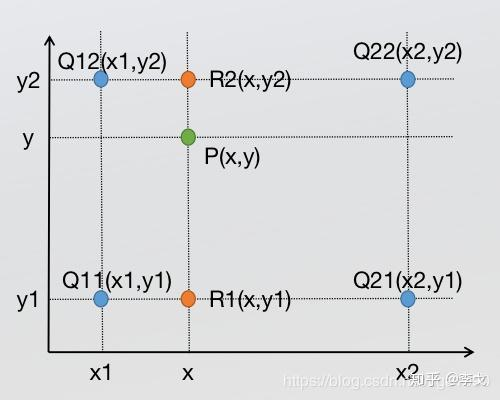
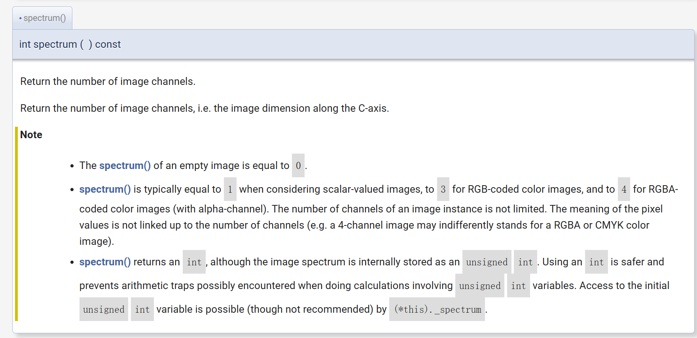
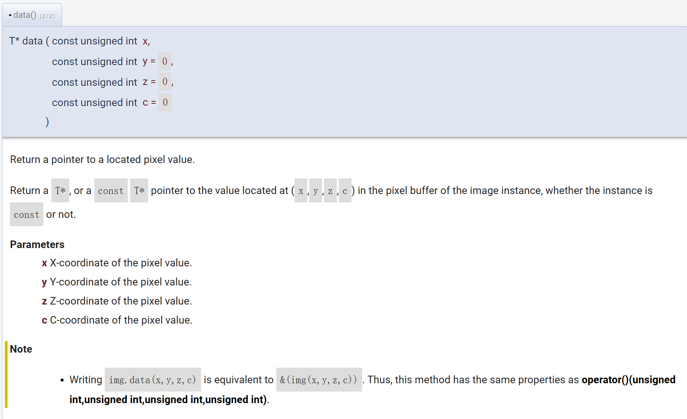
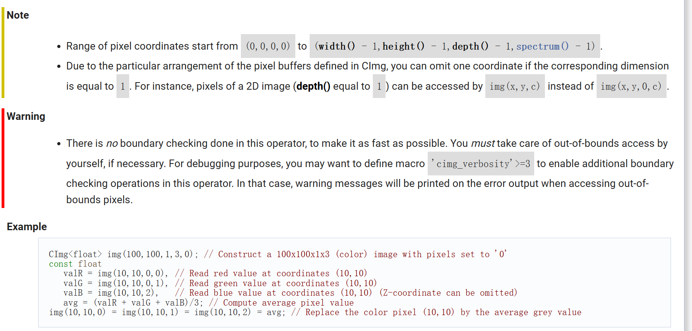

# 项目日志

## 一、项目流程

### 1. 图像数据的读取与写入存储，并展示图片

### 1.1 安装和配置开发环境（done！）

* **安装C++编译器** ：确保系统上安装了C++编译器（如GCC或Clang）。
* **安装CImg**

- **改成使用CImg了，弄了很久，发现是mingw的版本太旧了，更新后可以正常运行。**

### 项目实施流程

### 实现思路

1. **图像数据的读取与写入存储** ：(done!)

* 使用CImg库读取和写入图像文件。
* 使用CImg的显示功能展示图像。

1. **图像数据的压缩存储** ：(done!)

* 读取图片，将图片信息以三元组结构存储。
* 对三元组数据进行压缩存储。
* 读取压缩后的数据进行解码，得到原始图像数据，并进行保存。

1. **彩色图像转换为灰度图像** ：(done!)

* 使用CImg库读取彩色图像。
* 将彩色图像转换为灰度图像。
* 保存并展示灰度图像。

1. **图像尺寸的缩放** ：

* 使用CImg库读取图像。
* 实现图像的缩放功能。
* 保存并展示缩放后的图像。

### 详细步骤

#### 1. 图像数据的读取与写入存储(done!)

* 使用CImg库的 `CImg` 类来读取和写入图片文件。

示例代码：

C++

```cpp
#include "CImg.h"
using namespace cimg_library;

int main() {
    // 读取图像
    CImg<unsigned char> image("input.png");
  
    // 显示图像
    CImgDisplay display(image, "Image");

    // 保存图像
    image.save("output.png");

    // 保持窗口打开，直到用户关闭它
    while (!display.is_closed()) {
        display.wait();
    }
    return 0;
}
```

#### 2. 图像数据的压缩存储(done!)

* 将图像数据转换为三元组结构，进行压缩存储。
* 压缩算法可以选择简单的RLE（Run-Length Encoding）等。

1. **读取图像数据** ：

* 使用CImg库读取图像。
* 将图像数据转换为三元组结构 `(x, y, color)`。

1. **压缩三元组数据** ：

* 选择压缩算法（如Run-Length Encoding、Huffman编码等）。
* 对三元组数据进行压缩。

1. **存储压缩数据** ：

* 将压缩后的数据存储到文件中。

1. **读取和解压缩数据** ：

* 从文件中读取压缩数据。
* 对压缩数据进行解码，得到原始图像数据。

1. **保存解码后的图像** ：

* 使用CImg库将解码后的数据保存为图像。
* 

示例代码（伪代码）：

C++

```cpp
// 将图像数据转换为三元组结构
// 压缩存储
// 解码并恢复原始图像数据
```

#### 3. 彩色图像转换为灰度图像(done!)

* 使用CImg库的 `RGBtoYCbCr` 方法转换彩色图像为灰度图像。

示例代码：

C++

```cpp
#include "CImg.h"
using namespace cimg_library;

int main() {
    // 读取彩色图像
    CImg<unsigned char> color_image("input.ppm");

    // 转换为灰度图像
    CImg<unsigned char> gray_image = color_image.RGBtoYCbCr().channel(0);

    // 显示灰度图像
    CImgDisplay display(gray_image, "Gray Image");

    // 保存灰度图像
    gray_image.save("gray_output.ppm");

    // 保持窗口打开，直到用户关闭它
    while (!display.is_closed()) {
        display.wait();
    }
    return 0;
}
```

#### 4. 图像尺寸的缩放

* 使用CImg库的 `resize` 方法实现图像的缩放。
* 思考采用双线性插值对应关系：
  * 分别在两个方向计算了共3次单线性插值，如图所示，先在x方向求2次单线性插值，获得R1(x, y1)、R2(x, y2)两个临时点，再在y方向计算1次单线性插值得出P(x, y)（实际上调换2次轴的方向先y后x也是一样的结果）
  * 

示例代码：

C++

```cpp
#include "CImg.h"
using namespace cimg_library;

int main() {
    // 读取图像
    CImg<unsigned char> image("input.png");

    // 缩放图像
    CImg<unsigned char> resized_image = image.resize(image.width() / 2, image.height() / 2);

    // 显示缩放后的图像
    CImgDisplay display(resized_image, "Resized Image");

    // 保存缩放后的图像
    resized_image.save("resized_output.png");

    // 保持窗口打开，直到用户关闭它
    while (!display.is_closed()) {
        display.wait();
    }
    return 0;
}
```

### 总结

* **读取与写入** ：使用CImg库的 `load` 和 `save` 方法。
* **压缩存储** ：设计一个压缩算法（如RLE），将图像数据转换为三元组结构并压缩存储。
* **彩色转灰度** ：使用CImg库的 `RGBtoYCbCr` 方法，并只保留Y通道。
* **图像缩放** ：使用CImg库的 `resize` 方法。

1. **环境配置** ：

* 安装并配置C++编译器和OpenCV库。

1. **分阶段实现** ：

* 按照上述功能分阶段编写代码和实现，并在每个阶段进行测试和验证。

1. **测试与调试** ：

* 使用提供的PPM格式测试数据进行验证，确保各个功能正确实现。

1. **编写文档** ：

* 记录项目的设计思路、使用的算法和实现细节，撰写项目文档。

## 二、具体实施时遇到的问题与解决

1. 安装openCV的时候出现了很大的问题，然后尝试CImg，发现也不行，后来尝试升级mingw版本，可以正常使用CImg了，opencv未尝试。
2. CImg读取图片会出错也不知道是什么原因
   *CImg没有读取图片的解释器（似乎），需要安装ImageMagick，然后在编译的时候把其文件路径给加上（我觉得后续可以写个cmakefile或者makefile，简化所有编译命令）。。
3. 编译命令：`g++ -o test test.cpp -I D:\Desktop\data_strcture\Proj2\CImg -I E:\software\ImageMagick-7.1.1-Q16\include -L E:\software\ImageMagick-7.1.1-Q16\lib -lCORE_RL_Magick++_ -lCORE_RL_MagickCore_ -lCORE_RL_MagickWand_ -lgdi32`

`g++ -o test2 test2.cpp -I D:\Desktop\data_strcture\Proj2\CImg -I E:\software\ImageMagick-7.1.1-Q16\include -L E:\software\ImageMagick-7.1.1-Q16\lib -lCORE_RL_Magick++_ -lCORE_RL_MagickCore_ -lCORE_RL_MagickWand_ -lgdi32`

4. 过程中使用到的CImg函数：[The CImg Library - C++ Template Image Processing Toolkit - Reference Documentation](https://cimg.eu/reference/structcimg__library_1_1CImg.html#accb8526e4303186fb6246ac1301fdf66)



获取信息，如位置信息，颜色信息（可以获取灰度或RGB各个channel）




